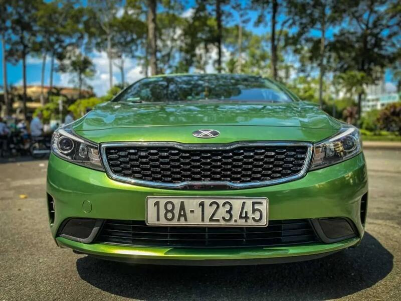
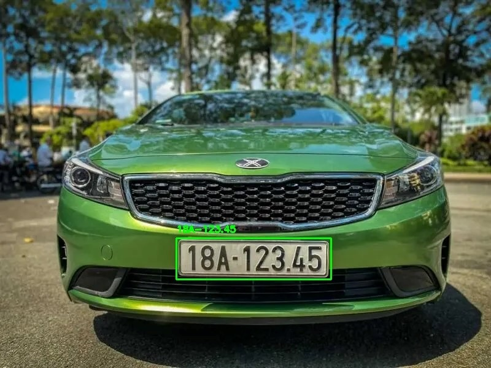
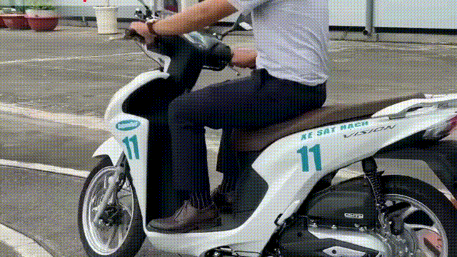

# License Plate Detector OCR🎟️

[](https://github.com/danhtran2mind/License-Plate-Detector-OCR/stargazers)


[](https://huggingface.co/docs/hub)
[](https://pytorch.org/)
[](https://pytorch.org/vision/stable/index.html)
[](https://pypi.org/project/pillow/)
[](https://numpy.org/)
[](https://opencv.org/)
 [](https://docs.ultralytics.com/models/yolo12/)
[](https://github.com/PaddlePaddle/PaddleOCR/tree/release/2.9)

[](https://opensource.org/licenses/MIT)

## Introduction

Detect license plates from images or videos and read their text using advanced computer vision and OCR for accurate identification.

## Key Features 🎯

-   **Real-Time Detection**  🚗: YOLOv12n delivers fast, accurate license plate detection in images/videos, optimized for low-latency performance.
-   **Accurate OCR**  📝: PaddleOCR v2.9 ensures high-precision license plate text extraction across various plate designs.
-   **Multi-Platform Datasets**  📊: Supports Kaggle, HuggingFace, and Roboflow datasets for robust training and generalization.
-   **Efficient Design with ONNX Export**  ⚡: Lightweight YOLOv12n model, exportable to ONNX format for cross-platform compatibility and optimized inference on CPU, GPU, or NPU hardware.
-   **ONNX Inference**  🚀: Utilizes ONNX Runtime for efficient, scalable inference, enabling seamless deployment on diverse devices with minimal latency.
-   **Gradio GUI**  🖥️: Intuitive interface for visualizing detection and OCR results, integrated with ONNX-based inference workflows.
-   **Flexible Inference**  📸: Processes images and videos using ONNX Runtime, supporting a wide range of real-world applications.
-   **Customizable Training**  🛠️: Includes scripts for dataset preparation, training, and exporting YOLOv12n to ONNX for streamlined model deployment.
-   **Scalable Use**  🌐: Ideal for autonomous driving, surveillance, and traffic systems, with ONNX enabling deployment on edge devices and cloud platforms.
-   
## Dataset

For your project requiring a large license plate dataset for training, the many datasets referenced from Kaggle, HuggingFace, and Roboflow are suitable choices for training machine learning models for license plate detection and recognition tasks. Below is a description of each dataset and how they can be utilized for your project:

- [](https://www.kaggle.com/datasets/fareselmenshawii/large-license-plate-dataset)
- [](https://www.kaggle.com/datasets/duydieunguyen/licenseplates)
- [](https://www.kaggle.com/datasets/ronakgohil/license-plate-dataset)
- [](https://www.kaggle.com/datasets/bomaich/vnlicenseplate)
- [](https://www.kaggle.com/datasets/congtuu/vietnamese-license-plate-obb)
- [](https://www.kaggle.com/datasets/haitonthat/vietnam-license-plate-bounding-box)
- [](https://universe.roboflow.com/university-of-southeastern-philippines-cnl9c/license-plate-detection-merged-projects)
- [](https://universe.roboflow.com/ev-dshfb/license-plate-w8chc)
- [](https://universe.roboflow.com/kanwal-masroor-gv4jr/yolov7-license-plate-detection)
- [](https://huggingface.co/datasets/keremberke/license-plate-object-detection)

## Base Model

This project utilizes the YOLOv12 architecture, specifically the YOLO12n model, a lightweight and efficient solution from Ultralytics for real-time object detection. The YOLO12n model employs an attention-centric design, delivering high accuracy and optimized performance for applications like autonomous driving, surveillance, and robotics. The YOLOv12 source code available at [](https://github.com/sunsmarterjie/yolov12), powered by the [](https://docs.ultralytics.com) platform, with comprehensive documentation available for setup, training, and deployment.

## Notebook
You can explore Training and Evaluation Notebook at:

[](https://colab.research.google.com/github/danhtran2mind/License-Plate-Detector-OCR/blob/main/notebooks/license-plate-detector-ocr.ipynb)
[](https://studiolab.sagemaker.aws/import/github/danhtran2mind/License-Plate-Detector-OCR/blob/main/notebooks/license-plate-detector-ocr.ipynb)
[](https://deepnote.com/launch?url=https://github.com/danhtran2mind/License-Plate-Detector-OCR/blob/main/notebooks/license-plate-detector-ocr.ipynb)
[](https://mybinder.org/v2/gh/danhtran2mind/License-Plate-Detector-OCR/main?filepath=notebooks/license-plate-detector-ocr.ipynb)
[](https://console.paperspace.com/github/danhtran2mind/License-Plate-Detector-OCR/blob/main/notebooks/license-plate-detector-ocr.ipynb)
[](https://mybinder.org/v2/gh/danhtran2mind/License-Plate-Detector-OCR/main)
[](https://www.kaggle.com/notebooks/welcome?src=https%3A%2F%2Fgithub.com%2Fdanhtran2mind/License-Plate-Detector-OCR/blob/main/notebooks/license-plate-detector-ocr.ipynb)
[](https://github.com/danhtran2mind/License-Plate-Detector-OCR/blob/main/notebooks/license-plate-detector-ocr.ipynb)

## Demonstration
License-Plate-Detector-OCR uses computer vision, OCR to detect, read license plates:
- **HuggingFace Space**: [](https://huggingface.co/spaces/danhtran2mind/License-Plate-Detector-OCR)

- **Demo GUI**:  
  

To run the Gradio app locally (`localhost:7860`):  
```bash
python apps/gradio_app.py
```


## Usage Guide

### Setup Instructions

#### Step 1: Clone the Repository
Clone the project repository and navigate to the project directory:
```bash
git clone https://github.com/danhtran2mind/License-Plate-Detector-OCR.git
cd License-Plate-Detector-OCR
```

#### Step 2: Install Dependencies
Install the required Python packages:
```bash
pip install -r requirements/requirements.txt
```

#### Step 3: Configure the Environment
Run the following scripts to set up the project:
- **Prepare Dataset (Optional, for Training)**  
  - Using `Kaggle`, `Roboflow`, `HuggingFace`
    ```bash
    python scripts/download_and_process_datasets.py --roboflow-api-key <your_roboflow_api_key>
    ```
  - Using `Kaggle`, `HuggingFace` only
    ```bash
    python scripts/download_and_process_datasets.py --platforms kaggle huggingface
    ```
  - Using `Roboflow` only
    ```bash
    python scripts/download_and_process_datasets.py --platforms roboflow --roboflow-api-key 
    <your_roboflow_api_key>
    ```
  
- **Download Model Checkpoints**  
  ```bash
  python scripts/download_ckpts.py
  ```
- Scripts Arguments
Refer to the [Scripts Documents](docs/scripts/scripts_doc.md) for detailed Scripts Arguments used in fine-tuning the model. ⚙️

### Training
- To train the model:
```bash
python src/license_plate_detector_ocr/training/train_yolo.py
```
- Training Arguments
Refer to the [Training Documents](docs/training/training_doc.md) for detailed Training Arguments used in fine-tuning the model. ⚙️

### Inference
To generate videos using the trained model:
```bash
python src/license_plate_detector_ocr/infer.py \
  --input_path <input_image_or_video_file>\
  --output_path <output_image_or_video_file>
```
- Inference Arguments
Refer to the [Inference Documents](docs/inference/inference_doc.md) for detailed Inference Arguments used in fine-tuning the model. ⚙️
## Inference Samples

| Input Type | Input | Output |
|:----------:|:-----:|:------:|
| Image | | |
| Video || |

## Environment
- **Python**: 3.10 or higher
- **Key Libraries**: See [requirements_compatible.txt](requirements/requirements_compatible.txt) for compatible versions

## Project Description

This project utilizes:

- **Detection task**: YOLOv12 architecture model (YOLO12n) from [](https://github.com/sunsmarterjie/yolov12) and documentation at [](https://docs.ultralytics.com/models/yolo12/), powered by the Ultralytics platform: [](https://docs.ultralytics.com).

- **OCR task**: PaddleOCR v2.9 from [](https://github.com/PaddlePaddle/PaddleOCR/tree/release/2.9), with the main repository at [](https://github.com/PaddlePaddle/PaddleOCR) for OCR inference. Explore more about PaddleOCR at [](https://www.paddleocr.ai/main/en/index.html).


