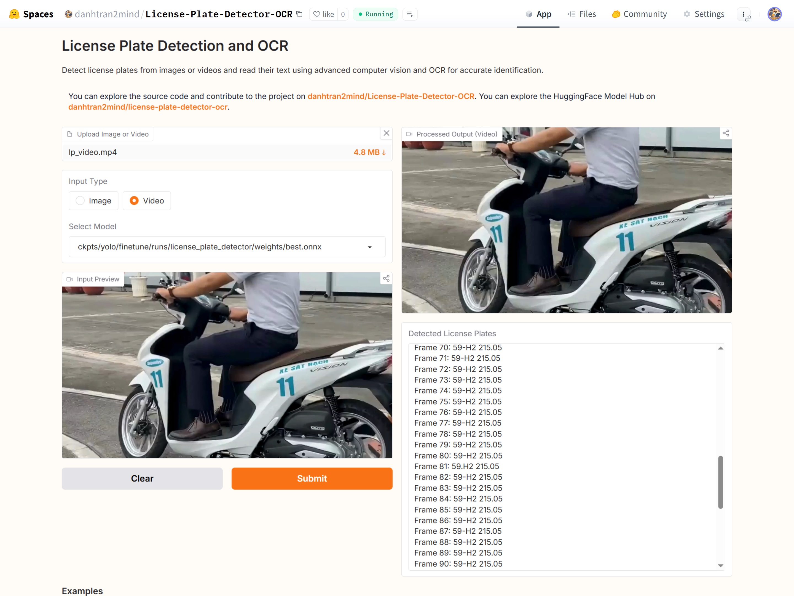

# License-Plate-Detector-OCR🎟️ (License-Plate-Detector-OCR)


## Introduction

## Key Features

## Notebook


## Dataset

## Base Model

## Demonstration
Experience the magic of Ghibli-style video generation:  
- **HuggingFace Space**: [](https://huggingface.co/spaces/danhtran2mind/Text2Video-Ghibli-style)

- **Demo GUI**:  
  

To run the Gradio app locally (`localhost:7860`):  
```bash
python apps/gradio_app.py
```


## Usage Guide

### Setup Instructions

#### Step 1: Clone the Repository
Clone the project repository and navigate to the project directory:
```bash
git clone https://github.com/danhtran2mind/Text2Video-Ghibli-style.git
cd Text2Video-Ghibli-style
```

#### Step 2: Install Dependencies
Install the required Python packages:
```bash
pip install -r requirements/requirements.txt
```

#### Step 3: Configure the Environment
Run the following scripts to set up the project:
- **Install Third-Party Dependencies**  
  ```bash
  python scripts/setup_third_party.py
  ```
- **Download Model Checkpoints**  
  ```bash
  python scripts/download_ckpts.py
  ```
- **Prepare Dataset (Optional, for Training)**  
  ```bash
  python scripts/process_dataset.py
  ```

### Training
- To train the model:
```bash
python src/text2video_ghibli_style/train.py
```
- Training Hyperparameters
Refer to the [Training Documents](docs/training/training_doc.md) for detailed hyperparameters used in fine-tuning the model. ⚙️

### Inference
To generate videos using the trained model:
```bash
python src/text2video_ghibli_style/inference.py
```

## Inference Samples


## Environment
- **Python**: 3.10 or higher
- **Key Libraries**: See [requirements_compatible.txt](requirements/requirements_compatible.txt) for compatible versions
<!-- 
## Contact
For questions or issues, please use the [GitHub Issues tab](https://github.com/danhtran2mind/Text2Video-Ghibli-style/issues) or the [Hugging Face Community tab](https://huggingface.co/spaces/danhtran2mind/Text2Video-Ghibli-style/discussions). 📬 -->


<!-- 
## Project Description

This repository is trained from [](https://github.com/danhtran2mind/MotionDirector), a fork of [](https://github.com/showlab/MotionDirector), with numerous bug fixes and rewritten code for improved performance and stability. You can download the `zeroscope_v2_576w` model from the [](https://huggingface.co/cerspense/zeroscope_v2_576w). Explore more models on [](https://huggingface.co/cerspense). -->